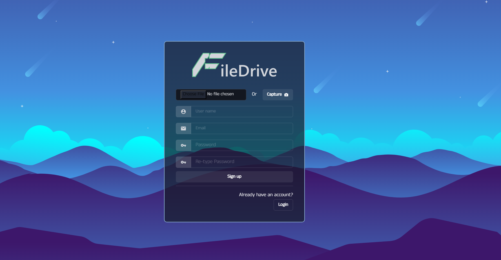

# **FileDrive**

  

This project maintains specialized frontend design with a backend API. I used **React** as the frontend library and **Chakra UI** for design purposes. For backend development, I used the famous PHP framework **Laravel**.

## Login Page

## Registration Page

> Both pages have control over the camera so that the user can take a real-time picture.

## Home Page

### Nav Bar

1. **Logo**
2. **Admin Panel Button** (only visible for admins)
3. **Bug or Feedback Submission Panel**
   - 

### Left Panel

1. **Profile Picture**
2. **Name, File, and Folder Stats**
3. **Profile Update Field**
   - 
4. **Storage Usage**
   -   

### Mid Panel

1. **Folder and File Addition and Deletion with Necessary Toast**
   -  
2. **Files Viewer** of the corresponding folder selected in the menu.

### Right Panel

1. **History of Uploaded Files** organized into three sections.

## Admin Page

### Nav Bar

1. **Dashboard Link**
2. **Bug/Feedback Review**
   - 

### Left Panel

1. **All Users List**
2. **Search Through Users**
3. **Actions on Selected User from Admin**
   - 

### Mid Panel

> A **Statistics Section** showing user ID and their usage data.

### Right Panel

> **List of Current Admins**.
